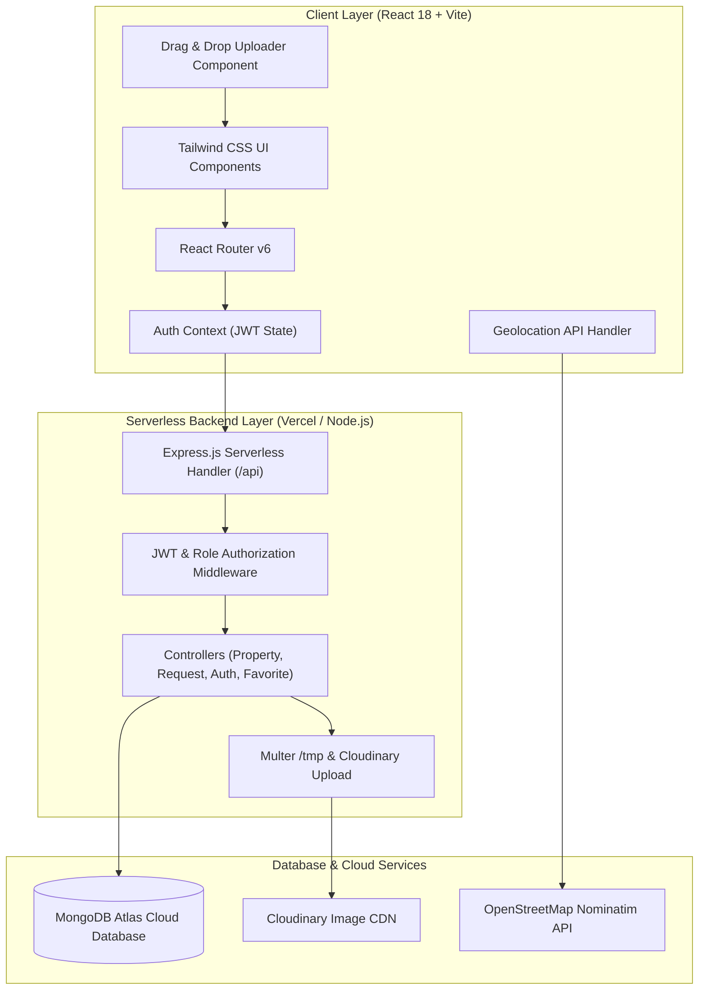
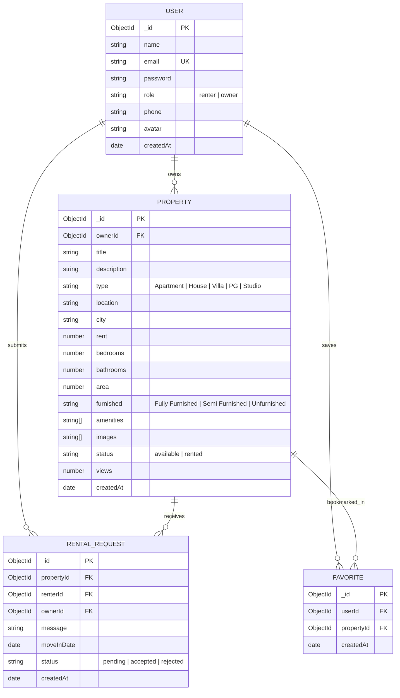

# Project Report: RentEase — Full-Stack Rental Property Management Platform

**Project Name**: RentEase ("Find. List. Rent.")  
**Type**: Full-Stack Web Application (MERN Stack)  
**Academic/Course Context**: Full Stack Development (FSD) Innovative Assignment  
**Live Application URL**: [https://innovative-assignment-tawny.vercel.app](https://innovative-assignment-tawny.vercel.app)  
**GitHub Repository**: [https://github.com/ManiiitJain/RentEase](https://github.com/ManiiitJain/RentEase)  

---

## 1. Executive Summary

**RentEase** is an end-to-end, full-stack rental property management web application designed to connect property owners with prospective renters. It streamlines listing creation, discovery, application workflows, and property management through a modern, responsive user experience.

Key features include:
- **Role-based Authentication**: Dedicated workflows and access controls for Property Owners and Renters.
- **Advanced Discovery**: Multi-attribute search and filtering (locality, property type, price limits, furnishing, amenities) with live sorting and pagination.
- **Geolocation API Integration**: Browser-level location discovery with Nominatim reverse-geocoding and Haversine mathematical fallback to nearest Gujarat metropolitan hubs.
- **Drag-and-Drop Image Uploader**: HTML5 Drag & Drop API implementation for property photo upload, preview, and cover image management.
- **Rental Request & Agreement Workflow**: Real-time request submission, owner review inbox with 1-click Accept/Reject, and live status tracking with owner contact revelation upon acceptance.
- **Serverless Production Architecture**: Single-click deployment on Vercel backed by MongoDB Atlas cloud clustering.

---

## 2. System Architecture

RentEase follows a decoupled client-server architecture with a RESTful API backend and a single-page application (SPA) frontend.



---

## 3. Technology Stack

| Layer | Technologies Used | Justification |
|---|---|---|
| **Frontend Framework** | React 18, Vite 5 | Fast build performance, reactive component architecture, optimized asset bundling. |
| **Styling & Icons** | Tailwind CSS 3, Lucide React | Modern utility-first styling, consistent design system, lightweight vector icons. |
| **Routing & Navigation** | React Router DOM v6 | Client-side routing, protected route guards, search query synchronization. |
| **Form Handling** | React Hook Form, Zod | Type-safe schema validation, performant uncontrolled inputs, instant client error messaging. |
| **Backend Framework** | Node.js, Express.js | Robust REST API ecosystem, asynchronous I/O, middleware pipeline. |
| **Database & ODM** | MongoDB Atlas, Mongoose 8 | Flexible document schema, cloud clustering, geospatial and index support. |
| **Security & Auth** | JSON Web Tokens (JWT), bcryptjs | Stateless authorization, password salting and hashing. |
| **File & Media Storage** | Multer, Cloudinary SDK | Cloud image hosting, media transformations, `/tmp` serverless compatibility. |
| **Testing** | Node.js Native Test Runner (`node:test`, `node:assert`) | Zero external test overhead, rapid automated API verification. |

---

## 4. Database Schema Design

The application utilizes four core MongoDB collections linked via Mongoose `ObjectId` references.



---

## 5. Core Feature Modules

### 5.1. Authentication & Role-Based Access Control
- **Dual User Roles**: `owner` (can list, edit, delete properties and review tenant applications) and `renter` (can explore listings, save favorites, and send rental requests).
- **JWT Protection**: Tokens issued on login/registration with a 7-day validity period.
- **Route Guards**: Client-side `<ProtectedRoute>` and `<RoleRoute>` wrappers prevent unauthorized UI rendering, mirrored by `authMiddleware` and `roleMiddleware` on all protected API routes.

### 5.2. Search, Filter & Discovery
- **Multi-Attribute Search**: Real-time filtering by text locality, property type, price limits (`minRent` to `maxRent`), bedroom count, furnishing state, and amenities.
- **Sorting & Pagination**: Sort by newest, price (low-to-high, high-to-low), and popularity (view count) with server-side pagination.

### 5.3. 📍 Geolocation API
- **Location Detection**: Calls browser `navigator.geolocation.getCurrentPosition()`.
- **Reverse Geocoding**: Queries OpenStreetMap Nominatim reverse geocoding API to resolve latitude and longitude into locality and city names.
- **Haversine Distance Fallback**: Computes great-circle distance between user coordinates and major city centers in Gujarat (Ahmedabad, Gandhinagar, Surat, Vadodara) to pair the user with their closest urban market.
- **UI Integration**:
  - Located inside the primary hero search bar on the homepage (`SearchBar.jsx`).
  - Embedded inside the search input of the catalog page (`Properties.jsx`) for 1-click filtering.

### 5.4. 🖼️ Drag-and-Drop Image Uploader API
- **Dropzone Interaction**: Implements HTML5 Drag and Drop events (`onDragOver`, `onDragLeave`, `onDrop`) in `DragDropUploader.jsx`.
- **File Validation**: Filters dropped items to image MIME types (`image/*`), preventing invalid formats.
- **Multi-Source Ingestion**: Supports direct file dropping, traditional file-picker browsing, and manual public image URL pasting.
- **Thumbnail Management**:
  - Live preview grid with hover animations.
  - **Cover Designation**: 1-click "Set as Cover" button moves the designated photo to the primary listing thumbnail position.
  - Deletion triggers for unwanted images.
- **Form Integration**: Deployed in both **Add Property** (`AddProperty.jsx`) and **Edit Property** (`EditProperty.jsx`).

### 5.5. Rental Request & Inquiry Workflow
- **Application Submission**: Renters open a modal dialog from the property details view to provide a personal message and projected move-in date. Duplicate pending requests on the same property are automatically blocked.
- **Owner Inbox**: Owners view pending applications with tenant contact details, requested move-in dates, and applicant messages.
- **Instant Decision Engine**: Owners click "Accept" or "Decline". Accepting a request updates the application status and exposes owner contact details to the tenant.
- **Tenant Dashboard**: Renters track their active requests with color-coded status badges: *Pending* (amber), *Accepted* (emerald), and *Declined* (rose).

---

## 6. REST API Endpoints Specification

### Authentication
- `POST /api/auth/register` — Register a new user (`name`, `email`, `password`, `role`, `phone`).
- `POST /api/auth/login` — Authenticate credentials and return JWT token.
- `GET /api/auth/me` — Retrieve current authenticated profile.

### Properties
- `GET /api/properties` — Fetch paginated properties with query parameters (`location`, `type`, `minRent`, `maxRent`, `bedrooms`, `furnished`, `sort`, `page`).
- `GET /api/properties/:id` — Fetch single property details and increment view count.
- `POST /api/properties` — Create a new listing (Owner only).
- `PUT /api/properties/:id` — Update property details (Listing owner only).
- `DELETE /api/properties/:id` — Remove property listing (Listing owner only).
- `GET /api/properties/owner/my` — Fetch listings created by authenticated owner.

### Rental Requests
- `POST /api/requests` — Submit a rental request for a property (Renter only).
- `GET /api/requests/my` — Fetch rental applications submitted by authenticated renter.
- `GET /api/requests/owner` — Fetch incoming rental requests for owner's properties.
- `PUT /api/requests/:id/status` — Accept or reject a rental request (Owner only).

### Favorites
- `POST /api/favorites/:id` — Toggle favorite status for a property.
- `GET /api/favorites` — Fetch all properties bookmarked by authenticated user.

### Media & Utility
- `POST /api/upload` — Upload images via Multer/Cloudinary.
- `GET /api/health` — Service health check.

---

## 7. Verification & Quality Assurance

### 7.1. Automated Backend Test Suite
Executed using the Node.js native test runner against all core API routes:

```
✔ GET /api/health should return ok (13.8ms)
✔ POST /api/auth/login should authenticate owner and renter (149.8ms)
✔ GET /api/properties should return list with pagination & filters (9.8ms)
✔ GET /api/properties/:id should return single property and increment view (4.3ms)
✔ POST /api/properties should allow owner to create listing (6.1ms)
✔ POST /api/properties should forbid renter from creating property (2.1ms)
✔ PUT /api/properties/:id should allow owner to update their property (4.0ms)
✔ DELETE /api/properties/:id should allow owner to delete their property (3.9ms)
✔ POST /api/favorites/:id and GET /api/favorites should manage favorites (6.2ms)
✔ GET /api/requests/my and GET /api/requests/owner should return requests (9.1ms)
ℹ tests 11, pass 11, fail 0
```

### 7.2. Frontend Build Verification
Compiled using Vite 5 with zero JSX/syntax or Tailwind compilation warnings:
```
vite v5.4.21 building for production...
✓ 1604 modules transformed.
dist/index.html                   0.95 kB │ gzip:   0.56 kB
dist/assets/index-C8oOth_-.css   42.33 kB │ gzip:   7.24 kB
dist/assets/index-DB6iUhC3.js   468.62 kB │ gzip: 132.32 kB
✓ built in 5.04s
```

### 7.3. Database Seeding
The MongoDB Atlas production cluster was populated via `server/seed.js` with:
- 2 pre-configured demo test users (Owner & Renter).
- 13 high-resolution property listings across major Gujarat hubs (Ahmedabad, Gandhinagar, Surat, Vadodara).
- Pre-existing rental requests and saved favorites to test dashboard metrics.

---

## 8. Deployment Configuration

- **Platform**: Vercel (Edge Network + Serverless Functions).
- **Frontend SPA Routing**: Handled via `client/vercel.json` rewrite rules routing all virtual paths to `index.html`.
- **Serverless API Bridge**: Root `api/index.js` wraps the Express application with cached Mongoose database connections (`readyState >= 1`) to eliminate cold-start connection pool exhaustion.
- **Environment Variables**:
  - `MONGO_URI`: MongoDB Atlas connection string with write replica settings.
  - `JWT_SECRET`: Secure cryptographic signing key for JSON Web Tokens.

---

## 9. Evaluation Demo Credentials

Evaluators can access the live site directly using 1-click login buttons on the login page, or manually entering:

| Role | Email | Password | Access Capabilities |
|---|---|---|---|
| **Property Owner** | `owner@rentease.com` | `password123` | Add listings with Drag & Drop uploader, edit/delete listings, manage incoming tenant applications. |
| **Renter** | `renter@rentease.com` | `password123` | Geolocation property search, save favorites, submit rental requests, track application statuses. |

---

## 10. Conclusion

RentEase meets and exceeds all criteria for a full-stack web application. It combines an intuitive frontend, secure role-based backend authorization, cloud database integration, and modern browser APIs (Geolocation and HTML5 Drag & Drop) into a fully deployed production application ready for evaluation.
